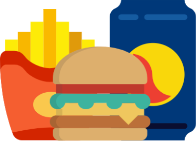

#  Drive-Thru (Placeholder)

For impulse buying junk food and regretting all of my life's decisions.

## How it works/User Story

User drives by a popular chain fast food restaurant with a drive thru. (e.g., Wendy's)
    * Notification pops up that asks the user if they want food in a nearby radius. If no, dismiss notification. If yes, the app presents a list of restaurants.
    * Upon selection of a restaurant, the app displays the menu with prices.
    * User orders, pays via app, and rolls up into drive-thru.
    * The order and payment is sent to the restaurant and user can confirm order number to restaurant.
  
## Why this app is needed

It's not, but man do I want the ease of going through a drive-thru coupled with not needed to yell and being misheard by the restaurant workers (poor sods). I also like the streamlined efficiency of a drive-thru over ordering online, driving up, parking in a parking spot, and waiting and hoping the restaurant notices me (sempai) and delivers my food to my car. 

I also would like to streamline the online ordering of fast food to one app, without resorting to Grubhub/delivery, which has its own pros and cons.

## Gnarly Snarls that are sure to stall app development

Speed of payment and order must be as fast as possible in order to not hold up the drive-thru line. But if there isn't a huge line (like at Chick-Fil-A), why use the app?

Working with Ionic to deploy build; may be confusing to a first-timer like me.

Ensuring restaurants have up-to-date menu and menu prices.

### Technology

Ionic framework to build the app for both iOS and Android.
Google Maps API for location and location of restaurants.
Restaurant APIs for menus, if available. 
Payment via Apple Pay, Google Pay, Visa Checkout for credit/debit cards.